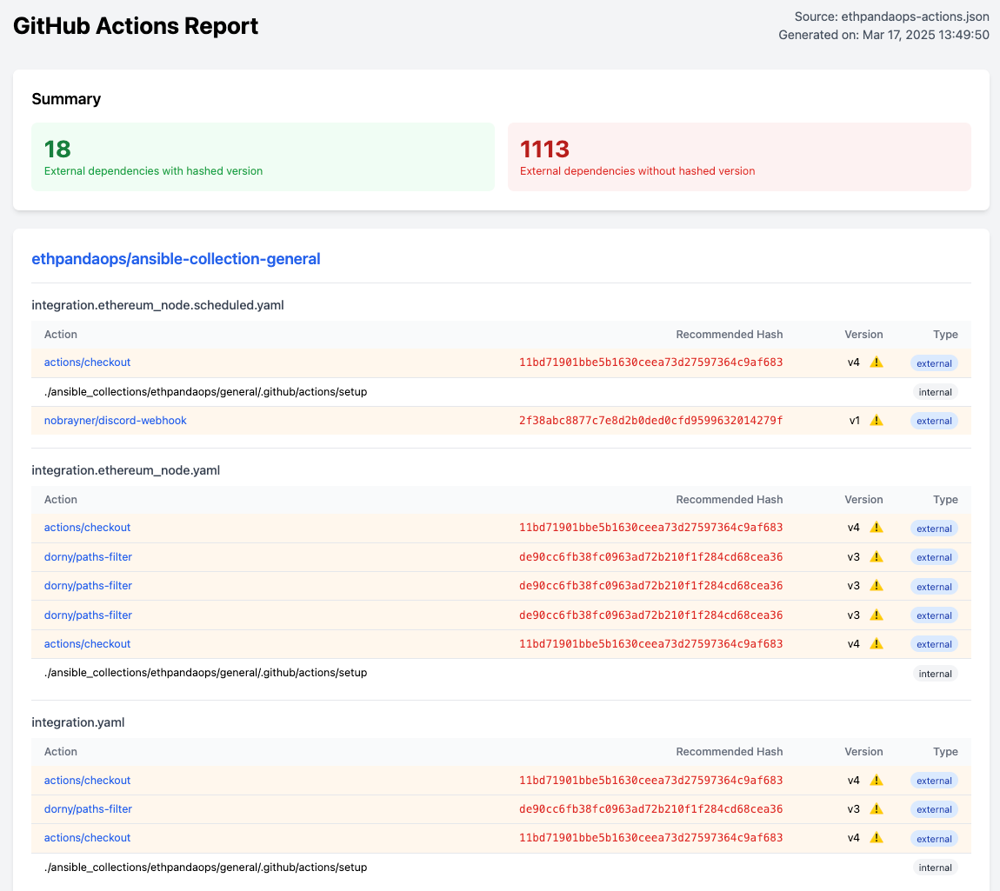

# GitHub Actions Dependency Analyzer

A tool to analyze GitHub Action dependencies in repositories and organizations, helping identify potential security risks from non-pinned action versions.

## Demo

There's a [report for the ethpandaops organization](https://ethpandaops.github.io/github-actions-checker/ethpandaops.html). This report is updated via the [verify-org](.github/workflows/verify-org.yaml) github workflow.

[](img/example-report.png)

## Why pin GitHub Actions?
Using version tags like v1 or v2 in GitHub Actions can be risky as the action maintainer can change the underlying code of any tag, or branch. Pinning to specific commit hashes ensures you're using a specific, immutable version of the action.

#### Example of a possible vulnerable pattern:

```yaml
- uses: actions/checkout@v3
```

#### More secure pattern:

```yaml
- uses: actions/checkout@f43a0e5ff2bd294095638e18286ca9a3d1956744
```

## Features
- Scan entire GitHub organizations or specific repositories
- Identify GitHub Actions used in workflows
- Detect actions using non-pinned versions (tags vs commit hashes)
- Generate detailed HTML reports with security recommendations
- Provide recommended commit hashes for safer pinning


## Quickstart using Docker

This will scan a specific repository and save the report to the current directory under ./reports. You'll see a .json and a .html file in the reports directory.

```sh
# Scan a specific repository and save the report to the current directory under ./reports
docker run --rm -it \
  -e GITHUB_TOKEN=$(gh auth token) \
  -v $PWD/reports:/reports \
  ghcr.io/ethpandaops/github-actions-checker:master \
  --repo ethpandaops/ethereum-helm-charts --output-dir /reports
```
Next you can use the previously generated report to dry-run a PR creation.
```sh
# Dry run a PR creation for the previous scan
docker run --rm -it \
  -e GITHUB_TOKEN=$(gh auth token) \
  -v $PWD/reports:/reports \
  ghcr.io/ethpandaops/github-actions-checker:master \
  create-pr --input /reports/ethpandaops-ethereum-helm-charts.json --repo ethpandaops/ethereum-helm-charts --dry-run
```

If you're happy with the changes, you can remove the `--dry-run` flag to actually create the PR. Note that for this you'll need to create a Personal Access Token (PAT) with the `contents` and `workflow` scopes. More info on how to create a PAT can be found [here](#creating-prs).

## Installation

```sh
# Clone the repository
git clone https://github.com/ethpandaops/github-actions-deps-checker
cd github-actions-checker

# Build the binary
make build

# Or install it directly
make install
```

## Usage
Set your GitHub token as an environment variable:

```sh
export GITHUB_TOKEN=your_github_token

# Protip: If you have github cli installed, you can use it to get your token
export GITHUB_TOKEN="$(gh auth token)"
```

#### Scan an organization
```sh
./action-deps --org ethpandaops
```

#### Scan a specific repository
```sh
./action-deps --repo ethpandaops/ethereum-helm-charts
```

#### Include archived repositories
```sh
./action-deps --org ethpandaops --include-archived
```

#### Generate an HTML report from JSON output (Useful for just debugging the HTML report)
```sh
./action-deps generate-html -i reports/ethpandaops-ethereum-helm-charts.json --output-dir reports
```

## Creating PRs

**Note:** You need to create a proper personal access token (PAT) for this one. If you're using the `$(gh auth token)` approach, that token won't have enought permissions.

Create a PAT under: https://github.com/settings/personal-access-tokens

Required scopes:
 - Contents: Read and Write
 - Workflow: Read and Write

#### Run in dry-run mode

This will show you what would be changed without actually creating a PR or a branch. Use the `--dry-run` flag.

```sh
./action-deps create-pr -i reports/ethpandaops-ethereum-helm-charts.json --repo ethpandaops/ethereum-helm-charts --dry-run
```

#### Create a branch with the changes, but don't create a PR

This will not create a PR, but will create a branch with the changes. Use the `--skip-pr` flag.

```sh
./action-deps create-pr -i reports/ethpandaops-ethereum-helm-charts.json --repo ethpandaops/ethereum-helm-charts --skip-pr
```

#### Create a PR from a personal fork

If you don't have write permissions on the repo that you're targeting, you might want to fork it first and create a branch there.
You can do that simply by providing the `--fork` flag. This will create a fork of the repo in your GitHub account (the account that owns the PAT token that you're using) and create a branch there.

```sh
./action-deps create-pr -i reports/ethpandaops-ethereum-helm-charts.json --repo ethpandaops/ethereum-helm-charts --fork
```

### Create multiple PRs for all repositories in a file

You don't have to always specify the `--repo` flag. If you pass the `--all` flag, the tool will read the JSON file and create a PR for each repository listed in the file.
```sh
./action-deps create-pr -i reports/your-organization.json --all
```

## License
This project is licensed under the GNU General Public License v3.0.
