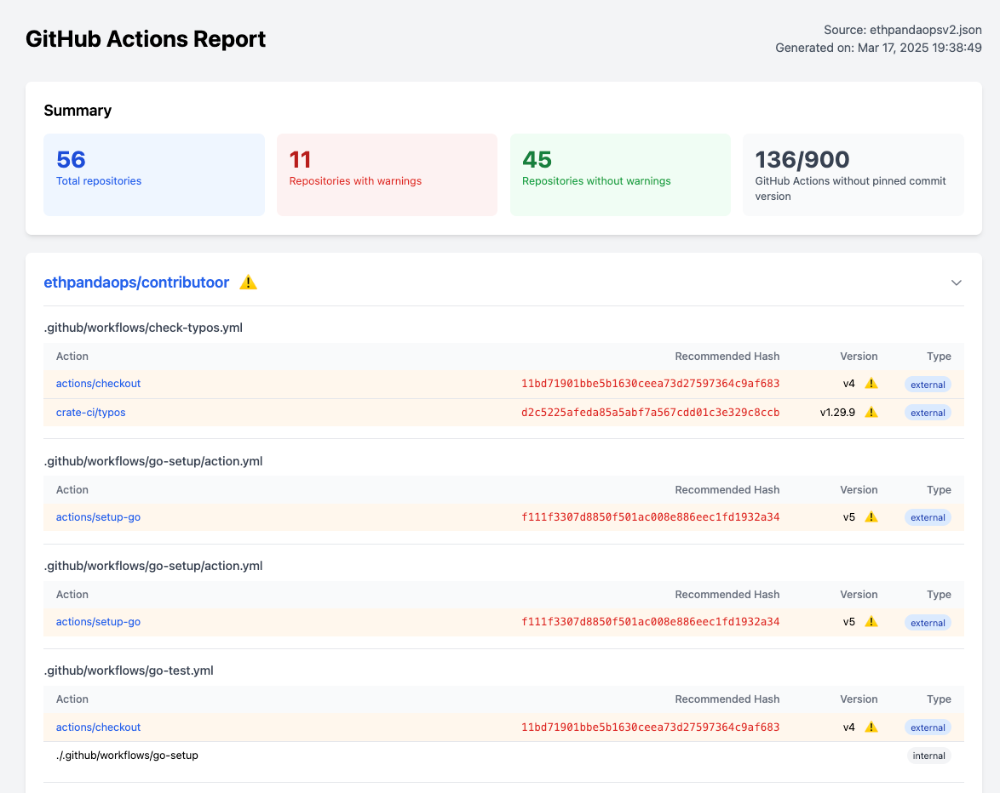

# GitHub Actions Dependency Analyzer

A tool to analyze GitHub Action dependencies in repositories and organizations, helping identify potential security risks from non-pinned action versions.

[](img/example-report.png)

## Why pin GitHub Actions?
Using version tags like v1 or v2 in GitHub Actions can be risky as the action maintainer can change the underlying code of any tag, or branch. Pinning to specific commit hashes ensures you're using a specific, immutable version of the action.

#### Example of a possible vulnerable pattern:

```yaml
- uses: actions/checkout@v3
```

#### More secure pattern:

```yaml
- uses: actions/checkout@f43a0e5ff2bd294095638e18286ca9a3d1956744
```

## Features
- Scan entire GitHub organizations or specific repositories
- Identify GitHub Actions used in workflows
- Detect actions using non-pinned versions (tags vs commit hashes)
- Generate detailed HTML reports with security recommendations
- Provide recommended commit hashes for safer pinning


## Quickstart using Docker

```sh
# Scan a specific repository and save the report to the current directory under ./reports
docker run --rm -it \
  -e GITHUB_TOKEN=$(gh auth token) \
  -v $PWD/reports:/reports \
  ghcr.io/ethpandaops/github-actions-checker:master \
  --repo ethpandaops/ethereum-helm-charts --output-dir /reports
```

## Installation

```sh
# Clone the repository
git clone https://github.com/ethpandaops/github-actions-deps-checker
cd github-actions-checker

# Build the binary
make build

# Or install it directly
make install
```

## Usage
Set your GitHub token as an environment variable:

```sh
export GITHUB_TOKEN=your_github_token

# Protip: If you have github cli installed, you can use it to get your token
export GITHUB_TOKEN="$(gh auth token)"
```

#### Scan an organization
```sh
./action-deps --org ethpandaops
```

#### Scan a specific repository
```sh
./action-deps --repo ethpandaops/ethereum-helm-charts
```

#### Include archived repositories
```sh
./action-deps --org ethpandaops --include-archived
```

#### Generate an HTML report from JSON output (Useful for just debugging the HTML report)
```sh
./action-deps generate-html -i reports/ethpandaops-ethereum-helm-charts.json --output-dir reports
```

## Creating PRs

**Note:** You might need to create a proper PAT token for this one. Your github cli token might not work due to missing the "workflow" scope.

#### Create a PR to update the GitHub Actions to use pinned hashes
```sh
./action-deps create-pr -i reports/ethpandaops-ethereum-helm-charts.json --repo ethpandaops/ethereum-helm-charts
```

### Create multiple PRs for all repositories in a file
```sh
./action-deps create-pr -i reports/your-organization.json --all
```

## License
This project is licensed under the GNU General Public License v3.0.
